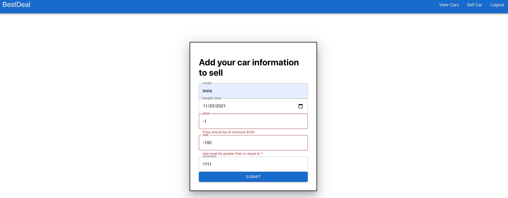

# BestDeal Website
A website to help users share their collection of second-hand cars

## App Features:
1. Users can register, login and logout from the website
2. Users can create their own collection of second-hand cars
   of different prices, size and usage history
3. Users can view others' posts

## Author:
Yanan Dong

Huixin Huang

## Project Link
[Direct to project] (https://)

## Class Link:
[Web Development CS5610 2021 Fall](https://johnguerra.co/classes/webDevelopment_fall_2021/)

## Project Objective:
- Develop backend application with Node + Express + Mongo and HTML5
- Learn how database interact with frontend service
- Learn how backend service serves for the webpage

## Screenshots:

## Tech Stack:
Node.js (Express)

MongoDB

Material-UI

Moment

React

Formik

Eslint

Docker

## Responsiility 
Person 1
-
-
-
Person 2
-
-
-

## Instructions to use:
1. Install node.js on your computer: [node operation](https://nodejs.org/en/download/)
2. clone repository git clone https://github.com/kamahuang2021/Bestdeal.git
3. We separate the frontend and backend and you can find the frontend in `/ui` directory 
4. Install backend dependencies using `npm install` at the project root directory
5. Install frontend dependencies using `npm install` or `yarn add` at `/ui` directory
6. Deploy mongodb locally using Docker via `docker run -d -p 27017:27017 mongodb:5.0.3`. For more information about Docker, please checkout [this](https://www.docker.com/get-started)
7. Use `npm run start` to start the express server at `:5000` and use `npm start` to start the frontend at `:3000`
