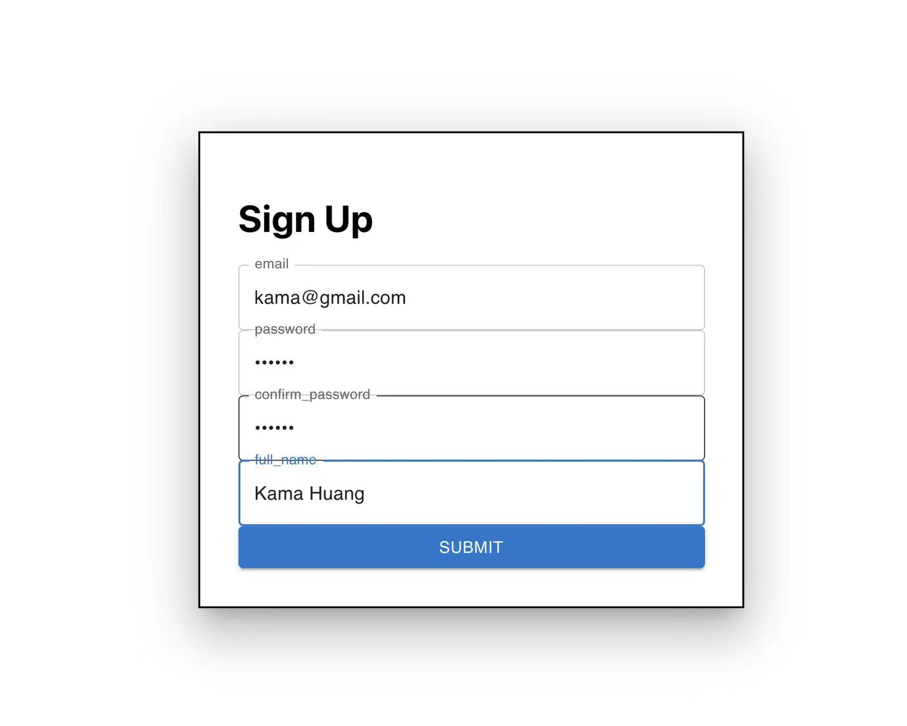
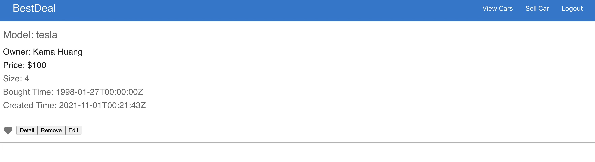

# BestDeal Website
A website to help users share their collection of second-hand cars

## App Features:
1. Users can create their own collection of second-hand cars
   of different prices, size and usage history
2. Users can view others' posts and leave comments

## Author:
Yanan Dong
Huixin Huang

## Class Link:
[Web Development CS5610 2021 Fall](https://johnguerra.co/classes/webDevelopment_fall_2021/)

## Video Demo:
[Video demonstration](https://www.youtube.com/watch?v=qf_M64YUM14&t=2s)

## Project Objective:
- Develop backend application with Node + Express + Mongo and HTML5
- Learn how database interact with frontend service
- Learn how backend service serves for the webpage

## Screenshots:

## Tech requirements:
Node.js (Express)
MongoDB
Material-UI
Moment
React
Formik

## Instructions to use:
1. Install node.js on your computer: [node operation](https://nodejs.org/en/download/)
2. clone repository git clone https://github.com/kamahuang2021/Bestdeal.git
3. We separate the frontend and backend and you can find the frontend in `/ui` directory.   
4. Install backend dependencies using `npm install` at the project root directory
5. Install frontend dependencies using `npm install` or `yarn add` at `/ui` directory
6. Use `node index.js` to start the express server at `:5000` and use `npm start` to start the frontend at `:3000`
